# Mirror

Private copy trading on Flare, powered by Flare Confidential Compute.

A lead encrypts a signal in the browser. A TEE decrypts it, sizes every follower from live FTSO prices and vault balances, and settles the fill on public contracts — without ever putting the strategy in the mempool. The chain sees ciphertext on the way in, a venue swap in the middle, and an FDC proof on the way out. Followers copy skilled flow into FXRP vaults. Searchers get noise.

#### NOTE: The ENTIRE project was built during the hackathon period!

---

## Important links

| Resource | URL |
|---|---|
| Live App | https://mirror-iota-gilt.vercel.app |
| Demo video | |

---

## Smart contracts

Deployed on **Flare Coston2** (chain ID `114`). Addresses are the live set recorded in [`config/coston2.json`](config/coston2.json). Explorer links open the Coston2 block explorer.

Default execution venue on this deployment is `mock-sparkdex`. The BlazeSwap FXRP/USDT0 pair below is **self-seeded test liquidity**, not third-party depth. The SparkDEX V3 router published for Flare **mainnet** (chain ID `14`) has no bytecode on Coston2 and must not be used here.

| Contract | Address |
|---|---|
| MirrorRegistry | [`0xfF4f9a603ebd126Db2BEc88A88a0fae6B2fB8065`](https://coston2-explorer.flare.network/address/0xfF4f9a603ebd126Db2BEc88A88a0fae6B2fB8065) |
| MirrorVault | [`0x283aA87660cB02D1ffcEDd028B401766C076BdB4`](https://coston2-explorer.flare.network/address/0x283aA87660cB02D1ffcEDd028B401766C076BdB4) |
| MirrorFee | [`0x8941c5ecA5Be7509Adf77e73A69187454Fcf1dEC`](https://coston2-explorer.flare.network/address/0x8941c5ecA5Be7509Adf77e73A69187454Fcf1dEC) |
| MirrorLeaderboard | [`0x9cBcDf16521b3705687349278990015886c957c9`](https://coston2-explorer.flare.network/address/0x9cBcDf16521b3705687349278990015886c957c9) |
| InstructionSender | [`0xf082D53B50D08f0fdC06B0B4C6A1932DB589d91f`](https://coston2-explorer.flare.network/address/0xf082D53B50D08f0fdC06B0B4C6A1932DB589d91f) |
| FtsoPriceReader | [`0xa8190FED2eF7c2cbC843904F974ae4F9EaF1fEA1`](https://coston2-explorer.flare.network/address/0xa8190FED2eF7c2cbC843904F974ae4F9EaF1fEA1) |
| AnchorDivergenceGuard | [`0x7e4C125Aae919e3F25F0A4C63cED6D11F6ee3bbB`](https://coston2-explorer.flare.network/address/0x7e4C125Aae919e3F25F0A4C63cED6D11F6ee3bbB) |
| MirrorFsaOnboarder | [`0x899921CB2d74B45BDC95baC8b8675757dE952671`](https://coston2-explorer.flare.network/address/0x899921CB2d74B45BDC95baC8b8675757dE952671) |
| MirrorHealthAuth | [`0xe7eBb372Ef34119874f55d2132e1f3F651e23612`](https://coston2-explorer.flare.network/address/0xe7eBb372Ef34119874f55d2132e1f3F651e23612) |
| MasterAccountController | [`0x434936d47503353f06750Db1A444DBDC5F0AD37c`](https://coston2-explorer.flare.network/address/0x434936d47503353f06750Db1A444DBDC5F0AD37c) |
| MockSparkDexRouter | [`0x6F3A431c74Ef7Ff30ed93569D4e8A43466E7F9e1`](https://coston2-explorer.flare.network/address/0x6F3A431c74Ef7Ff30ed93569D4e8A43466E7F9e1) |
| MockKineticPool | [`0x6ce64f1F6D60198281a4eA0aA639cAA10202554A`](https://coston2-explorer.flare.network/address/0x6ce64f1F6D60198281a4eA0aA639cAA10202554A) |
| MockEnosysCDP | [`0xB2f32371D761F52895E697C8b2910098cf57FA60`](https://coston2-explorer.flare.network/address/0xB2f32371D761F52895E697C8b2910098cf57FA60) |
| MockFirelightStrategy | [`0xa652DFD628be13feC4D56710D1cf281692deCE02`](https://coston2-explorer.flare.network/address/0xa652DFD628be13feC4D56710D1cf281692deCE02) |
| Firelight vault (real, staking deferred) | [`0xC90D6847747b85d1fa2E07859869fb9fB72c0361`](https://coston2-explorer.flare.network/address/0xC90D6847747b85d1fa2E07859869fb9fB72c0361) |
| BlazeSwap USDT0/FXRP pair (self-seeded) | [`0xa0B211953a3d8f42E82AfB01303933DdA5c434fe`](https://coston2-explorer.flare.network/address/0xa0B211953a3d8f42E82AfB01303933DdA5c434fe) |
| FXRP | [`0x0b6A3645c240605887a5532109323A3E12273dc7`](https://coston2-explorer.flare.network/address/0x0b6A3645c240605887a5532109323A3E12273dc7) |
| USDT0 | [`0xC1A5B41512496B80903D1f32d6dEa3a73212E71F`](https://coston2-explorer.flare.network/address/0xC1A5B41512496B80903D1f32d6dEa3a73212E71F) |

XRPL Testnet operator used for the Smart Account payment path: `rEyj8nsHLdgt79KJWzXR5BgF7ZbaohbXwq`.

---

## Table of contents

- [Introduction](#introduction)
  - [What Mirror is](#what-mirror-is)
  - [Who it is for](#who-it-is-for)
  - [The one loop that matters](#the-one-loop-that-matters)
- [The problem](#the-problem)
  - [Copy trading already won off-chain](#copy-trading-already-won-off-chain)
  - [The exposure loop](#the-exposure-loop)
  - [Why a normal contract cannot save it](#why-a-normal-contract-cannot-save-it)
  - [What Flare already has — and what it is missing](#what-flare-already-has--and-what-it-is-missing)
- [The solution](#the-solution)
  - [Copying is sealed](#copying-is-sealed)
  - [What makes Mirror different](#what-makes-mirror-different)
  - [Private versus public](#private-versus-public)
  - [Honesty about Coston2](#honesty-about-coston2)
- [Flare integration](#flare-integration)
  - [Confidential compute, extensions, and prices](#confidential-compute-extensions-and-prices)
  - [Proofs, assets, accounts, and venues](#proofs-assets-accounts-and-venues)
  - [Why these primitives are required, not decorative](#why-these-primitives-are-required-not-decorative)
  - [Why Flare, specifically](#why-flare-specifically)
  - [FCC and the two FCEs](#fcc-and-the-two-fces)
  - [Tee payments and protocol-managed wallets](#tee-payments-and-protocol-managed-wallets)
  - [FTSO v2 as the sizing oracle](#ftso-v2-as-the-sizing-oracle)
  - [FTSO anchors as a second clock](#ftso-anchors-as-a-second-clock)
  - [FDC as three attestation types](#fdc-as-three-attestation-types)
  - [FXRP as the vault's unit of account](#fxrp-as-the-vaults-unit-of-account)
  - [Smart Accounts as the XRPL door](#smart-accounts-as-the-xrpl-door)
  - [Venues as destinations, not brains](#venues-as-destinations-not-brains)
  - [What FCC is doing that a server cannot](#what-fcc-is-doing-that-a-server-cannot)
  - [What FDC is doing that an event log cannot](#what-fdc-is-doing-that-an-event-log-cannot)
- [How the system works](#how-the-system-works)
  - [Who uses Mirror](#who-uses-mirror)
  - [How the system connects](#how-the-system-connects)
  - [Web app and encryption](#web-app-and-encryption)
  - [Matching FCE](#matching-fce)
  - [Fill and settlement](#fill-and-settlement)
  - [Follower on Flare](#follower-on-flare)
  - [Follower from XRPL](#follower-from-xrpl)
  - [Scoring FCE](#scoring-fce)
  - [After the fill](#after-the-fill)
  - [Operator surfaces](#operator-surfaces)
  - [The signal, hop by hop](#the-signal-hop-by-hop)
  - [Sizing, in numbers rather than slogans](#sizing-in-numbers-rather-than-slogans)
  - [Scoring, in numbers rather than slogans](#scoring-in-numbers-rather-than-slogans)
  - [What the frontend is allowed to say](#what-the-frontend-is-allowed-to-say)
- [Contracts](#contracts)
  - [The call graph](#the-call-graph)
  - [MirrorRegistry](#mirrorregistry)
  - [MirrorVault](#mirrorvault)
  - [MirrorFee](#mirrorfee)
  - [MirrorLeaderboard](#mirrorleaderboard)
  - [InstructionSender](#instructionsender)
  - [AiAgentSender](#aiagentsender)
  - [FtsoPriceReader and AnchorDivergenceGuard](#ftsopricereader-and-anchordivergenceguard)
  - [MirrorFsaOnboarder and MirrorHealthAuth](#mirrorfsaonboarder-and-mirrorhealthauth)
  - [Venue stand-ins](#venue-stand-ins)
  - [InstructionSender, more slowly](#instructionsender-more-slowly)
  - [MirrorVault, more slowly](#mirrorvault-more-slowly)
  - [MirrorRegistry, more slowly](#mirrorregistry-more-slowly)
  - [MirrorFee, more slowly](#mirrorfee-more-slowly)
  - [Leaderboard and AiAgentSender, together](#leaderboard-and-aiagentsender-together)
  - [FSA onboarder, the three calls](#fsa-onboarder-the-three-calls)
  - [HealthAuth, the consent object](#healthauth-the-consent-object)
  - [Why mocks keep the real function names](#why-mocks-keep-the-real-function-names)
- [Roadmap](#roadmap)
- [Conclusion](#conclusion)

---

## Introduction

### What Mirror is

Mirror is a private copy-trading protocol for Flare DeFi.

A skilled trader — the **lead** — sells a strategy without publishing the strategy. Followers deposit FXRP into a vault keyed by `(follower, lead)`. When the lead has a trade, they do not broadcast a swap from a watched wallet. They encrypt an intent to the matching enclave's public key and send that ciphertext through Flare Confidential Compute as a `MATCH_V1` instruction.

Inside a Trusted Execution Environment, the matching Flare Compute Extension decrypts the intent, reads live FTSO prices, looks up every follower's unlocked vault balance, and sizes a proportional fill. The public chain then sees a venue swap. Vault balances and lead fees move only after Flare Data Connector proves that swap actually happened.

That last sentence is the product. Privacy without a public result is a black box. A public result without privacy is MEV bait. Mirror is the cut between those two failures.

### Who it is for

Three people share one vault graph after onboarding.

**Lead traders** already trade on Flare. They will not open a public wallet for copy if popularity is a tax. Mirror lets them set a performance fee between 0% and 20% and encrypt each signal in the browser. They see aggregate AUM. They do not see who is copying or how much each vault holds.

**Followers already on Flare** have FXRP. They pick a lead from Discover, choose a risk profile, deposit, and follow. The next encrypted signal is sized into their sub-account. They never see `sizePct` or direction. They see classification-level language and a vault delta.

**Followers who live on XRPL** pay XRP from Xaman. They never have to buy FLR first. Flare proves the payment, a Smart Account is opened, and [`MirrorFsaOnboarder`](contracts/src/MirrorFsaOnboarder.sol) registers, follows, and deposits in one instruction. From that moment the follower is identical to the Flare path.

Flare already has DEXes, lending, CDPs, and liquid staking around FXRP. It did not have a passive way to follow skilled flow without leaking the book. Mirror is that missing product.

### The one loop that matters

Every screen in the app, every FCE handler, and every settlement function exists to keep this loop intact:

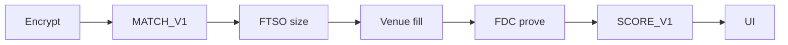

Encrypt happens in the browser. Matching and sizing happen in the TEE. The venue swap is public because a fill that cannot be checked is not a fill. FDC is the gate between “a swap occurred” and “vaults and fees may move.” Scoring happens in a **second** enclave so the matching code hash is not the scoring code hash. The UI is allowed to show the result, not the signal.

If any hop is skipped, the product collapses into something that already exists and already fails. A public signal is a public invitation to frontrun. A private fill with no proof is an operator. Mirror refuses both.

---

## The problem

### Copy trading already won off-chain

Copy trading is not a crypto novelty. It is one of the most proven retail products in finance.

eToro has on the order of forty million users. Bybit, OKX, and Bitget ship copy trading as a native feature, not a plugin. The demand is simple and enormous: people want skilled traders' performance without managing every position themselves.

That demand is not theoretical on-chain either. Flare already has DEXes, lending, and vaults. What it did not have is a way to follow a skilled trader without publishing the strategy as public calldata — which is exactly how copy trading gets farmed.

So the product category is proven. The primitive that makes copy *safe* on a transparent ledger was missing.

### The exposure loop

On a public chain, copy trading destroys itself as soon as it works.

A lead gets good. A wallet becomes popular. Followers watch every outbound swap. They submit replica transactions seconds later, in the clear, into the same mempool. Searchers see the lead, then the wave. They frontrun the original with higher gas, sandwich the copies, and extract the edge that made the lead worth following.

The lead gets a worse price. Every copier gets a worse price still. Popularity inverts the product. The better the strategy, the more it is farmed.

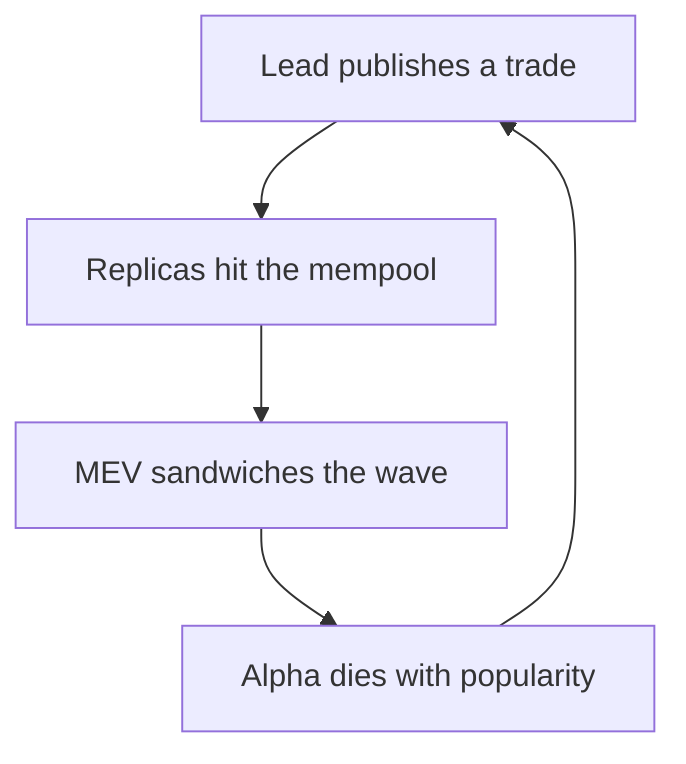

**Lead publishes a trade.** The wallet *is* the strategy. There is no separate signal channel. Anyone who can read logs can copy, including bots that copy faster than humans.

**Replicas hit the mempool.** Follower transactions are not a coordinated batch. They are a stampede of similar calldata, arriving after the original, fully visible.

**MEV sandwiches the wave.** This is not a maybe. It is the equilibrium of a public mempool when size is predictable and direction is known.

**Alpha dies with popularity.** Scale is supposed to be the reward. On a public chain, scale is the attack surface.

There is no clever fee, no commit-reveal that still reveals before execution, and no “please don't frontrun” social layer that changes this. If the intent is public before the fill, the fill is already priced in by someone with better latency.

### Why a normal contract cannot save it

A smart contract can custody funds. It can enforce a fee split. It can record who follows whom.

It cannot hide an intent that must be submitted as public calldata. It cannot decrypt a payload it is not allowed to see. It cannot size twenty follower vaults from live oracle prices without putting those sizes on-chain *before* the swap, which is exactly the information a searcher wants.

Commit-reveal schemes leak at reveal. Threshold encryption that decrypts on-chain still decrypts on-chain. A trusted operator who batches copies off-chain is copy trading with a custodian. That is the CEX product, not the Flare product.

The missing piece is a place where plaintext can exist **after** encryption and **before** the public swap, with a code hash anyone can check, and with settlement that does not take the operator's word. That place is a TEE registered as a Flare Compute Extension. Without it, Mirror would be a leaderboard of wallets waiting to be farmed.

### What Flare already has — and what it is missing

Flare is unusually well-stocked for this product — which makes the gap sharper.

| Flare already has | Still missing |
|---|---|
| DEXes, lending, CDPs, and liquid staking around FXRP | No copy-trading product of any kind |
| FTSO v2 prices at roughly 1.8 seconds, plus 90-second anchors | No encrypted signal path — a popular lead wallet is a public strategy |
| FDC proofs for EVM transactions, XRPL payments, and Web2 JSON | No FDC-gated settlement of copy fills and lead fees |
| FAssets and Smart Accounts so XRPL users can enter without FLR | No proportional, private fan-out of one intent into many vaults |
| FCC / TEE enclaves that can keep intent sealed until execution | No attested, risk-adjusted leaderboard — only raw PnL vanity |

That table is the entire reason Mirror exists.

Flare already solved oracle latency, attestation, XRP on EVM, and confidential compute. Nobody had assembled them into a copy product that stays private on the way in and public on the way out. FCC is not a bolt-on brand. It is the primitive that makes the category safe to exist on a transparent ledger.

---

## The solution

### Copying is sealed

On a public chain, copying is a leak. With Mirror, copying is sealed.

The lead encrypts. A TEE copies into FXRP vaults. The chain only sees the fill — after it happens, with a proof.

Three consequences follow, and they are the only three that matter to users.

**Leads can get popular.** Intent never hits the mempool as plaintext. Searchers see ciphertext. The strategy stays an edge instead of a public feed. AUM can grow without advertising the next `sizePct`.

**Followers get a fair fill.** One signal is sized per vault from live FTSO, not cloned as N identical transactions racing each other. Batched execution is the opposite of a stampede.

**Anyone can audit the result.** The swap is public. FDC proves it. Vaults and lead fees move only after that proof — not on an operator's word. Privacy is not an excuse for an opaque broker.

### What makes Mirror different

These are not a marketing grid. Each one is a load-bearing hop in the running system.

**Encrypt in the browser.** [`frontend/src/lib/encrypt.ts`](frontend/src/lib/encrypt.ts) locks the signal to the TEE uncompressed secp256k1 key (`0x04 || x || y`) using ECIES compatible with go-ethereum's crypto/ecies. Ciphertext only on-chain. Searchers get noise.

**Two separate TEEs.** Matching is not scoring. The matching FCE handles `MATCH_V1` and `TOPUP_V1`. The AI FCE handles `SCORE_V1` and classification. Independent code hashes. A bug or a compromised matching image does not silently rewrite how Sharpe is computed, and the scorer never submits the venue swap.

**Sized per vault.** Fan-out is `(balance − pendingLocked) × sizePctBps / 10_000` for each follower of that lead. Not one cloned transaction. A small vault does not ride a whale's notional.

**Live FTSO prices.** Sizes and expected output come from the oracle, not from a manipulable pool tick. Minimum out is 99% of expected. A stale AMM quote is not allowed to dictate follower size.

**Fees need a proof.** [`MirrorFee.claim`](contracts/src/MirrorFee.sol) reverts. Accrual is not payout. Payout is `releaseFee` after an FDC `EVMTransaction` attestation with a unique transaction hash and status `1`.

**Scores, not hype.** Composite 0–100 from Sharpe (40%), max drawdown (25%), cadence (20%), data completeness (15%). Documented in [`fce-ai-agent/typescript/src/app/scoring.ts`](fce-ai-agent/typescript/src/app/scoring.ts).

**You can start from XRP.** Xaman in. FDC Payment. Smart Account. No FLR required to follow. The XRPL path is how Mirror talks to the actual XRP holder, not only to people who already live on Coston2.

**Drift and health alerts.** Strategy class shifting away from baseline, and collateral ratio slipping under `13000` bps, surface in-app. Optional `TOPUP_V1` if the follower pre-authorized it. Copy products that cannot say “this lead is no longer the lead you followed” are how accounts blow up.

### Private versus public

This boundary is the product.

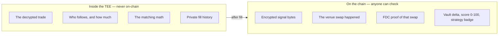

Inside the TEE: the decrypted trade, who follows and how much, the matching math, private fill history, Sharpe internals, the drift log, `SCORE_V1` events.

On the chain: encrypted signal bytes, the fact that a venue swap happened, the FDC proof of that swap, vault delta, score 0–100, strategy badge. Never the signal body.

Followers see classification-level summaries only — “mean-reversion lead, ahead on epoch P&L.” An adversarial pass in this repo asserts Stage B calldata is ciphertext-only. Local plaintext-decrypt fallback exists for development and is out of scope for that pass.

### Honesty about Coston2

Mirror is built against live Coston2 primitives: FTSO v2, FDC, FAssets/FXRP, Flare Smart Accounts, FCC/FCE.

It is also honest where Coston2 cannot host the mainnet venue:

- SparkDEX spot V3 router has **no bytecode** on Coston2. Execution uses [`MockSparkDexRouter`](contracts/src/mocks/MockSparkDexRouter.sol) with the same `exactInputSingle` ABI and real ERC20 transfers at live FTSO prices.
- BlazeSwap can run a real V2 swap against a **self-seeded** FXRP/USDT0 pair. That is a demonstration of external DEX calldata, not organic depth.
- Kinetic, Enosys, and Firelight *strategy routing* use interface-preserving mocks. A real Firelight vault address exists on Coston2 and is recorded; passive-staking UX is deferred.

---

## Flare integration

Mirror is not “DeFi, plus a TEE somewhere.” Each Flare primitive is used for the job it was designed to do. Remove one, and a specific failure mode returns.

### Confidential compute, extensions, and prices

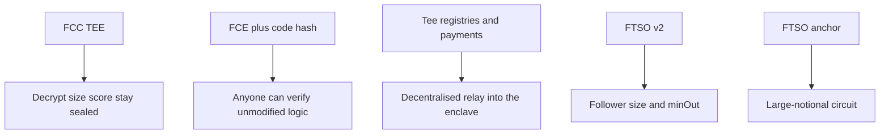

**FCC / TEE.** Matching and scoring FCEs run in confidential compute (AMD SEV in Confidential Space). Decrypt, size, and score stay sealed. A public contract cannot hide intent until after execution. Without the enclave, copy trading is MEV bait. This is the load-bearing wall.

**FCE + code hash.** Mirror is not a private HTTP service with a cute frontend. It is registered extensions with published hashes. [`config/fce-code-hashes.json`](config/fce-code-hashes.json) is the artifact of comparing matching versus AI digests. [`InstructionSender`](contracts/src/InstructionSender.sol) and [`AiAgentSender`](contracts/src/AiAgentSender.sol) latch extension ids. Anyone can verify matching logic is unmodified without reading a live signal.

The two FCEs must not share an identity. Matching extension `66187` is not the scoring extension. Simulated TEE mode can collide on a test `codeHash`; the running system distinguishes FCEs by extension id, sender contract, image, and op command. Do not claim on-chain hashes differ if `/info` matches.

**Tee registries + payments.** Instructions enter through `sendInstructions` with a `1e6` wei FCC fee — see `FCC_INSTRUCTION_FEE_WEI` in [`frontend/src/lib/encrypt.ts`](frontend/src/lib/encrypt.ts). TeeManager logs yield the instruction id the UI waits on. That is a decentralised relay into the enclave, not a private API the operator can silently swap for a different binary.

**FTSO v2 (~1.8s).** The TEE and [`FtsoPriceReader`](contracts/src/FtsoPriceReader.sol) quote FXRP/USD and USDT0/USD from `ContractRegistry`. Feed ids are the official `XRP/USD` and `USDT/USD` bytes21 values, used as proxies for FXRP and USDT0. Follower size and min-out must not be manipulable by a stale pool tick. Expected out uses the oracle; the swap reverts if the venue cannot deliver 99% of that expectation.

**FTSO anchor (~90s).** [`AnchorDivergenceGuard`](contracts/src/AnchorDivergenceGuard.sol) sits on large notionals. If `|block − anchor| / anchor` exceeds `maxDivergenceBps`, the path reverts. A second, slower reference stops a short FTSO blip from oversizing a copy wave. Small fills skip the check; the threshold exists so ordinary flow is not bricked by noise, while a crowded fan-out cannot ride a spike.

### Proofs, assets, accounts, and venues

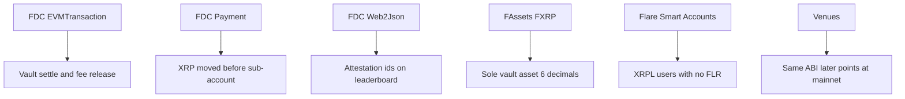

**FDC EVMTransaction.** After `executeMatch`, a relayer attests the venue `Swap`. InstructionSender checks router, amounts, unique hash, and status `1`. Vault settle and lead fee release are trust-minimised. The operator does not get to say “yes, it filled.”

**FDC Payment.** An XRPL Payment to the operator address is attested before `MasterAccountController.executeInstruction` proceeds. The protocol proves the XRP actually moved before a Flare sub-account is created. That is the difference between “we watched a websocket” and “Flare agreed the payment exists.”

**FDC Web2Json.** Score canaries attest DeFiLlama TVL / CoinGecko volume into attestation ids stored on the leaderboard. External market context is cryptographically referenced. It is **not** mixed into the 0–100 weights. The composite score stays a closed formula over private outcome history. Web2Json is provenance for context, not a hidden fourth factor.

**FAssets / FXRP.** Sole vault asset, 6 decimals. The TEE resolves via `AssetManagerFXRP.fAsset()` rather than a remembered mainnet address. Native XRP exposure on Flare DeFi — no wrapped-bridge custody story for the vault's unit of account.

**Flare Smart Accounts.** `PersonalAccount` plus [`MirrorFsaOnboarder.onboard`](contracts/src/MirrorFsaOnboarder.sol) (`registerFollowerAs` → `followLeadAs` → `vault.depositFor`). This opens Mirror to tens of millions of XRP addresses that have never held FLR. Combined Core Vault mint-and-onboard still needs mint liquidity on Coston2; the canary proves FDC Payment plus the onboarder.

**Venues.** SparkDEX V3 ABI (mock on Coston2). Optional BlazeSwap V2 against the self-seeded pair. Kinetic / Enosys / Firelight as interface mocks when `MIRROR_MOCK_VENUES` is set. Real Firelight vault reserved. Same calldata path swaps to mainnet routers later. Coston2 honesty: mocks are labeled, not hidden.

### Why these primitives are required, not decorative

It is tempting to read a Flare bounty as a checklist. Mirror fails that reading on purpose: every row above is a failure mode if omitted.

Without FCC, the signal is public and the exposure loop returns. Without a published FCE hash, the TEE is just a server. Without tee-registry payments, the operator owns the relay. Without FTSO, sizing is an AMM toy. Without anchors, a one-block oracle blip becomes a copy wave. Without FDC EVMTransaction, settlement is an admin function. Without FDC Payment, XRPL onboarding is a trusted indexer. Without FXRP, the vault is another wrapped IOU. Without Smart Accounts, the primary market never arrives.

The integration is the architecture. The subsections below stay on Flare itself — what each primitive actually does in this repo — before the walk of Mirror's own components.

### Why Flare, specifically

Copy trading could be sketched on any EVM. The sketch would die on day one for the reasons in [The problem](#the-problem). Flare is not "an EVM with an XRP ticker." It is the only stack Mirror needs that already contains **all** of: confidential compute as a network feature, a block-latency oracle, a data-connector that attests EVM txs *and* XRPL payments *and* Web2 JSON, an FAsset for XRP, and Smart Accounts so the XRP holder never has to buy the gas token first.

Other chains have mix-and-match pieces. A chain with a TEE marketplace but no native XRP asset still forces a bridge story. A chain with a great oracle but a public mempool and no enclave still farms the lead. A chain with FAssets and no FDC still settles on an operator's word. Mirror is not portable in the "swap the RPC and ship" sense, and that is a feature. The product is the assembly.

Coston2 (chain ID `114`) is where that assembly is proven. Flare mainnet (chain ID `14`) is where SparkDEX spot actually has bytecode. The repo is explicit about which addresses belong to which chain. `FlareContractRegistry` on Coston2 is `0xaD67FE66660Fb8dFE9d6b1b4240d8650e30F6019`. From there the TEE and [`FtsoPriceReader`](contracts/src/FtsoPriceReader.sol) resolve FtsoV2, and FXRP is resolved via `AssetManagerFXRP.fAsset()` rather than a remembered mainnet token.

If you take Mirror off Flare, you have to reinvent FCC, FTSO, FDC, FXRP, and FSA, or you have to lie about which of those you dropped. This README will not describe a generic "L2 copy vault."

### FCC and the two FCEs

Flare Confidential Compute is the place plaintext is allowed to exist. Not in the lead's RPC. Not in InstructionSender storage. Not in a Vercel log. Inside an attested enclave.

Mirror uses **two** Flare Compute Extensions, not one service with two HTTP routes.

The matching FCE ([`fce-matching-engine/`](fce-matching-engine/)) decrypts `MATCH_V1`, sizes from FTSO and vaults, and returns venue calldata. It also handles `TOPUP_V1` so collateral help still goes through the same execution family. Matching extension id `66187` is the live matching registration called out in operator docs. InstructionSender latches *its* extension id by scanning `TeeExtensionRegistry` until `getTeeExtensionInstructionsSender(i) == address(this)`.

The scoring FCE ([`fce-ai-agent/`](fce-ai-agent/)) consumes a private outcome log and emits `SCORE_V1`. [`AiAgentSender`](contracts/src/AiAgentSender.sol) is a **different** contract with a **different** extension id. `OP_COMMAND_SCORE_V1` is not a function on InstructionSender. That split is how a matching bug cannot silently rewrite Discover, and how a scoring image cannot submit a SparkDEX swap.

Published hashes live in [`config/fce-code-hashes.json`](config/fce-code-hashes.json). The comparison is matching digest versus AI digest. Simulated TEE mode can collide on a shared test `codeHash` (`0x194844cf…` appears in limitations notes). When `/info` hashes match, do not write "independent on-chain hashes" in a submission. Distinguish by extension id, sender, container, and op command. Honesty about FCC's bleeding-edge tooling is part of using FCC.

AMD SEV in Confidential Space is the hardware baseline. Multi-operator FCC is the path, not the present. Attestation means a reviewer can check that the enclave is the published image. It does not mean the host has vanished. The proxy still forwards. The executor still fills until PMW signs. FCC shrinks the plaintext surface. It does not delete logistics.

### Tee payments and protocol-managed wallets

Instructions do not arrive as a private POST that an operator could reroute. They arrive as `sendInstructions` on Flare's TEE extension registry, with a fee of `1e6` wei (`FCC_INSTRUCTION_FEE_WEI` in [`frontend/src/lib/encrypt.ts`](frontend/src/lib/encrypt.ts)).

That fee is a protocol ping, not a business model. It forces the instruction onto the same payment path every other FCE uses. TeeManager logs yield an instruction id. The UI waits on that id. The matching engine is selected from `getRandomTeeIds(extensionId, 1)` — a registry choice, not a hardcoded IP in the lead's browser.

### FTSO v2 as the sizing oracle

Follower size must not come from a pool tick the lead or a searcher can shove. Flare Time Series Oracle v2 publishes block-latency feeds on the order of 1.8 seconds. Mirror reads them **inside the TEE** and **on-chain** through the same family of feeds.

[`FtsoPriceReader`](contracts/src/FtsoPriceReader.sol) wraps `ContractRegistry.getTestFtsoV2()` — `TestFtsoV2Interface` is the Coston2 view path, not a toy oracle. Feed ids are official `bytes21` values from Flare's feed list, also pinned in [`scripts/ftso/feedIds.ts`](scripts/ftso/feedIds.ts):

```text
FXRP/USD  ←  XRP/USD   0x015852502f55534400000000000000000000000000
USDT0/USD ←  USDT/USD  0x01555344542f555344000000000000000000000000
```

FXRP is not a separate FTSO symbol. XRP/USD is the proxy because FXRP is the FAsset of XRP. USDT0/USD uses USDT/USD the same way. If those proxies ever diverge from the FAsset in a way that matters, that is an oracle-product problem to revisit, not a reason to size off an AMM.

Expected out for a swap is oracle-priced. `minOut` is 99% of that expectation. The 1% floor is slippage tolerance against the **oracle**, not against the last tick. A mock router that fills at mid will almost always pass. A thin mainnet pool might fail — and failing is correct. Copying into a 4% sandwich is not "best effort." It is the exposure loop at the venue instead of at the signal.

The matching FCE defaults RPC to `https://coston2-api.flare.network/ext/C/rpc` when enclave env cannot override `FLARE_RPC_URL` (FCC `allow_env_override` does not always include it). Prices used for sizing are still the public FTSO. Observers can check that the oracle was live at fill time. They cannot check `sizePct`. That is the intended split: public price, private fraction.

### FTSO anchors as a second clock

Block-latency feeds are fast. Fast oracles can blip. A copy wave is correlated size: N vaults times the same `sizePct` at the same second. A one-block spike that oversizes that wave is how you turn an oracle glitch into follower harm.

[`AnchorDivergenceGuard`](contracts/src/AnchorDivergenceGuard.sol) compares a block-latency price to a ~90s anchor, both in the same `inWei` scale. Below `notionalThresholdWei`, the check is a no-op so ordinary flow is not bricked by noise. Above the threshold, divergence in bps is `(diff * 10_000) / anchorPriceWei`. If that exceeds `maxDivergenceBps`, the call reverts `DivergenceExceeded`. Zero anchor reverts `InvalidAnchorPrice` — fail closed, not "skip the guard."

This is Flare's two-speed oracle used as a circuit breaker, not as a second trading signal. Mirror does not take the average of block and anchor and call it a price. It asks whether they *agree enough* to let a large fan-out proceed. Disagreement is a stop.

### FDC as three attestation types

Flare Data Connector is how Mirror borrows Flare's data-provider set instead of running a Mirror oracle.

**EVMTransaction** is the fill gate. After `executeMatch`, a relayer requests attestation of the venue transaction. InstructionSender checks the verifier, the router, the amounts, `status == 1`, and a unique `transactionHash`. `usedProofTxHashes` makes that hash a one-time ticket. Vault `settleFromProof` and fee `releaseFee` both hang off this type. Round time is an FDC window, not a block. Slow is not a bug. Slow is "wait for providers," which is the opposite of "trust the relayer's RAM."

**Payment** is how a follower who does not yet have a Flare wallet can still open a copy vault. They send a deposit from the XRP Ledger (Xaman). Flare's data providers then attest that this payment actually landed. Only after that proof does Mirror create their Smart Account and credit FXRP into `(follower, lead)`. A watcher script may notice the payment earlier so the UI can say “we saw it”; that notice is not permission to onboard. The attestation is. Without this split, onboarding would trust an indexer instead of Flare.

**Web2Json** is the footnote. DeFiLlama TVL and CoinGecko volume can be attested into a `bytes32` on [`MirrorLeaderboard`](contracts/src/MirrorLeaderboard.sol). The composite score **does not** take those numbers as inputs. Sharpe 40 / drawdown 25 / cadence 20 / completeness 15 is closed over the private outcome log. Web2Json answers "in what market context was this score published?" It does not answer "is this lead good?"

### FXRP as the vault's unit of account

[`MirrorVault`](contracts/src/MirrorVault.sol) is single-asset. The immutable token is FXRP at 6 decimals, the Coston2 FAsset at [`0x0b6A3645c240605887a5532109323A3E12273dc7`](https://coston2-explorer.flare.network/address/0x0b6A3645c240605887a5532109323A3E12273dc7).

That is not "we wrapped XRP in a hurry." FAssets are Flare's native representation of non-smart-contract tokens. The TEE is told to resolve `AssetManagerFXRP.fAsset()` so a hardcoded mainnet FXRP cannot sneak into Coston2 configs. USDT0 ([`0xC1A5B41512496B80903D1f32d6dEa3a73212E71F`](https://coston2-explorer.flare.network/address/0xC1A5B41512496B80903D1f32d6dEa3a73212E71F)) is the other side of a spot swap, not a second vault currency. A BUY/SELL in the sealed signal is a swap between those two, settled back into FXRP accounting for the sub-account.

No wrapped-bridge custody story: the vault holds FXRP, which is already the Flare-native XRP. Followers who arrived from XRPL via FSA are holding the same unit as followers who arrived with FXRP in MetaMask. That unity is the point of FAssets in this product.

### Smart Accounts as the XRPL door

Forty million XRP addresses exist in the market. Asking them to buy C2FLR, learn an EVM wallet, and then copy is how you lose them.

Flare Smart Accounts exist so an XRPL signature can produce a `PersonalAccount` on the C-chain. Mirror's piece is [`MirrorFsaOnboarder`](contracts/src/MirrorFsaOnboarder.sol), invoked as a custom instruction (`0xFE` in the FSA flow). `msg.sender` is the PersonalAccount. One `onboard(lead, amount, riskProfile)` call registers, follows, and `depositFor`s.

`MasterAccountController` at [`0x434936d47503353f06750Db1A444DBDC5F0AD37c`](https://coston2-explorer.flare.network/address/0x434936d47503353f06750Db1A444DBDC5F0AD37c) is Flare's controller in this deploy, not a Mirror-written custodian. Mirror does not replace FSA. It plugs into it after FDC Payment.

### Venues as destinations, not brains

Flare DeFi is where the copy lands. It is not where the copy is decided.

SparkDEX V3 `exactInputSingle` is the primary ABI. On **mainnet**, `SwapRouter` is `0x8a1E35F5c98C4E85B36B7B253222eE17773b2781` with factory `0x8A2578d23d4C532cC9A98FaD91C0523f5efDE652` and an FXRP/USDT0 pool — recorded under `mainnetReference` in [`config/coston2.json`](config/coston2.json) with the note **do not use on Coston2**. Those addresses have **no bytecode** on chain 114. Execution here uses [`MockSparkDexRouter`](contracts/src/mocks/MockSparkDexRouter.sol) at [`0x6F3A431c74Ef7Ff30ed93569D4e8A43466E7F9e1`](https://coston2-explorer.flare.network/address/0x6F3A431c74Ef7Ff30ed93569D4e8A43466E7F9e1): same ABI, real ERC20 transfers, FTSO prices.

BlazeSwap is live on Coston2 as a V2-style DEX, liquidity-starved for FXRP/USDT0 until this repo self-seeded pair [`0xa0B211953a3d8f42E82AfB01303933DdA5c434fe`](https://coston2-explorer.flare.network/address/0xa0B211953a3d8f42E82AfB01303933DdA5c434fe). That swap is a real external DEX transaction against the team's own LP. It is not third-party depth. Default `executionVenue` remains `mock-sparkdex`.

Kinetic, Enosys, Firelight are strategy destinations the classifier already has words for (lending, CDP, yield). Coston2 cannot host them as Mirror's primary path today: Kinetic unverified here, Enosys on a different testnet, Firelight vault real at [`0xC90D6847747b85d1fa2E07859869fb9fB72c0361`](https://coston2-explorer.flare.network/address/0xC90D6847747b85d1fa2E07859869fb9fB72c0361) but staking UX deferred. Mocks preserve interfaces so mainnet is a config change.

The matching FCE encodes calldata **to** a venue. It does not let SparkDEX decide who follows whom. If a venue becomes the brain, you are back to a public strategy plus extra hops.

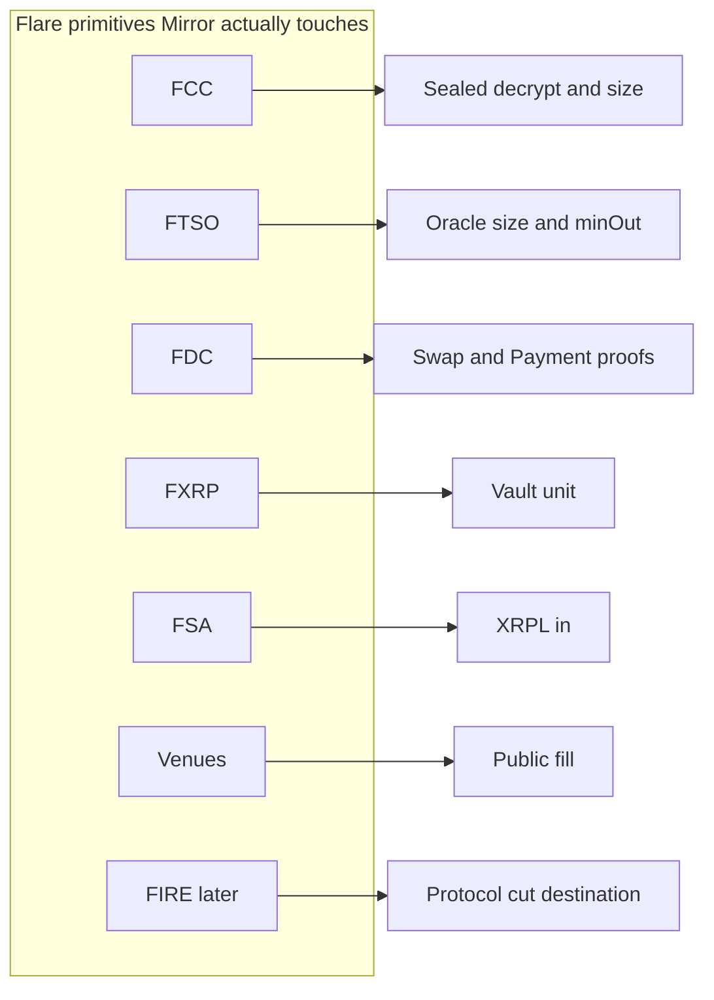

That is the whole Flare map. Everything in [How the system works](#how-the-system-works) is an arrow on this map, not a fifth oracle.

### What FCC is doing that a server cannot

A public contract cannot decrypt the signal without putting `sizePct` and direction in the mempool. A private server can decrypt, but nobody can check the binary or prove it did not drop a follower. FCC is the third place: plaintext only inside an attested enclave, then a public swap plus an FDC proof. Decrypt where a contract cannot; prove where a server will not.

### What FDC is doing that an event log cannot

`MatchExecuted` is an event. Anyone can see it. It is not a settlement.

An event is Mirror's own mouth. An FDC `EVMTransaction` proof is Flare's data providers agreeing that a transaction landed on the C-chain with a given hash, status, and decoded shape. InstructionSender then binds that proof to a specific `PendingFill`: router, amounts, uniqueness.

If settlement listened only to `MatchExecuted`, a compromised executor could emit a convincing log — or, more mundanely, a partial fill could be described as a full one. The proof's `status == 1` and amount checks are how the vault refuses fiction.

The XRPL path is the same pattern with a different attestation type. A websocket seeing a Payment is convenience. FDC Payment is the gate. The monitor is allowed to be early. The Smart Account is not allowed to be early.

Web2Json is the third attestation Mirror touches, and the one most likely to be misunderstood. It does not price a fill. It does not size a vault. It does not move FXRP. It attaches an external context id to a score record so that, later, a reviewer can say “this score was computed in a world where DeFiLlama reported this TVL,” without letting DeFiLlama vote on the 0–100. Mixing Web2 into the weights would let a website outage look like a lead's drawdown. Keeping it as `attestationId` is how Mirror stays a formula with footnotes rather than a formula with a ghost parameter.

Three attestation types, three jobs:

| Attestation | Job in Mirror | What it is not |
|---|---|---|
| EVMTransaction | Prove the venue swap for vault + fees | Not a signal body |
| Payment | Prove XRPL XRP moved before FSA onboard | Not a substitute for mint liquidity |
| Web2Json | Footnote external context on the leaderboard | Not a fourth score weight |

If a fourth attestation appears in a future PR, it should get a row in a table like this or it does not belong.

---

## How the system works

### Who uses Mirror

Three people. After onboarding, they share one vault graph — a lead's sealed signal copies into each follower's FXRP.

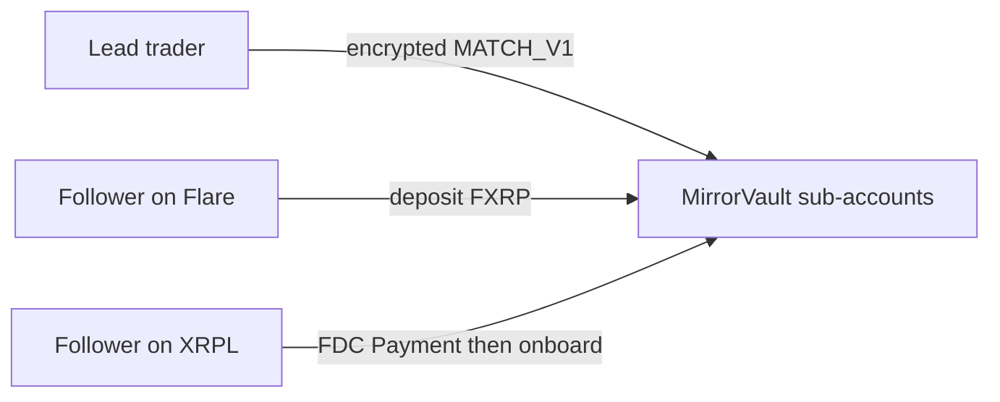

**Lead trader — sells a strategy without leaking it.** Sets a fee (0–20%) and encrypts each trade in the browser. Followers copy automatically. The lead sees total AUM, never who is copying or how much. Needs a Flare wallet and already trades.

**Follower already on Flare — deposits FXRP and is done.** Picks a lead from Discover, chooses risk, deposits. The next encrypted signal is sized into their vault. They never see the trade itself — only the result. Needs FXRP on Flare.

**Follower from XRPL / Xaman — pays XRP, never holds FLR.** Pays from Xaman. Flare proves the payment, opens a Smart Account, and credits an FXRP vault. From there it is the same as the Flare follower path.

The social graph is deliberately thin. Leads do not message followers. Followers do not see each other. The registry stores `followAllocations[follower][lead]`. That mapping is public identity, not public size-of-next-trade. Allocation on the registry is the follow relationship; execution size is computed inside the TEE from **current unlocked vault balance**, which can change between signals.

### How the system connects

From the frontend, the two FCEs, the contracts, and the relayers — not from a slide.

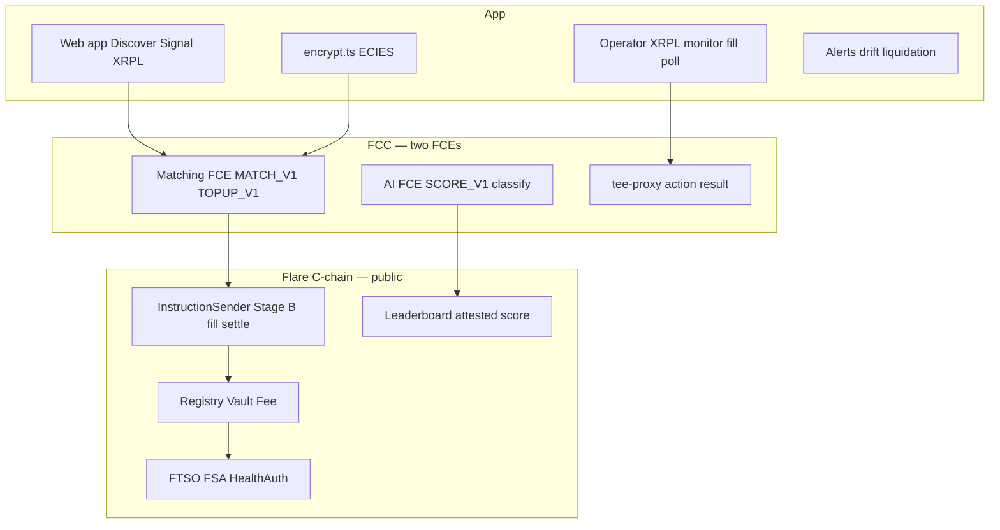

**App.** Next.js in [`frontend/`](frontend/). Discover, lead profile, signal, portfolio, withdraw, XRPL onboard. Client encryption never sends plaintext to an API. Operator scripts in [`scripts/relayer/`](scripts/relayer/) poll fills, watch XRPL, and push FDC proofs. Alerts are classification and health, not a trade tape.

**TEE, private.** Matching FCE in [`fce-matching-engine/`](fce-matching-engine/). AI FCE in [`fce-ai-agent/`](fce-ai-agent/). `tee-proxy` is the public endpoint that forwards signed instructions and exposes `/action/result/{id}`. The proxy is not allowed to be the matching logic. If it were, the code hash would be theater.

**C-chain, public.** InstructionSender is Stage B in, fill, and settle. Registry, Vault, and Fee are identity, FXRP, and FDC-gated fees. Leaderboard is attested score 0–100. FTSO, FSA, and HealthAuth sit beside them as the oracle, the XRPL door, and the opt-in top-up switch.

The arrows are the privacy boundary. Green in the pitch (sealed) never becomes blue (on-chain) except as ciphertext, a swap, a proof, or a number that cannot reconstruct the book.

### Web app and encryption

A lead does not “place a trade” in the Mirror UI. They publish a sealed instruction.

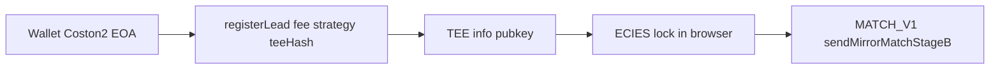

Onboarding hits [`frontend/src/app/lead/onboard/page.tsx`](frontend/src/app/lead/onboard/page.tsx): `registerLead` with strategy type, fee rate, minimum allocation, and `teePublicKeyHash`. The hash binds the lead to the encryption target they claim. If the UI later encrypts to a different key, followers are not silently retargeted without a registry update.

Signal submission lives at [`frontend/src/app/signal/page.tsx`](frontend/src/app/signal/page.tsx). The page fetches the TEE uncompressed key from `/info` via the proxy. Encryption is local:

```ts
// frontend/src/lib/encrypt.ts
export type SignalPayload = {
  asset: string;
  direction: "BUY" | "SELL";
  sizePct: number;
  nonce: string;
  recipient: string;
  lead?: string;
};
```

The body is FXRP-only in spirit even when `USDT0` is a legal asset string: the vault is single-asset FXRP. Direction and `sizePct` are the strategy. Nonce stops replays. `recipient` is the lead (or a routing hint); the TEE still expands to on-chain followers from the registry rather than trusting a client-supplied crowd.

ECIES here matches go-ethereum: AES-128-CTR, SHA-256, HMAC-SHA256, secp256k1. That is not an aesthetic choice. The tee-node `/decrypt` path expects that envelope. A homegrown box would decrypt nowhere.

The UI then waits on `MatchExecuted`. It does **not** call `executeMatch`. A fill-worker does. If the page were allowed to execute, every lead browser would be an executor key. The split is intentional: encrypt locally, wait publicly, never sign the venue swap from the lead's wallet.

Discover and the lead page ([`frontend/src/app/discover/page.tsx`](frontend/src/app/discover/page.tsx), [`frontend/src/app/lead/[address]/page.tsx`](frontend/src/app/lead/[address]/page.tsx)) show score, strategy badge, and fee. They do not show the last signal. Portfolio language stays at classification level. That is not a UX flourish. It is the same privacy boundary as the contracts, applied to English.

FCC instruction fee is `1e6` wei. Small enough to be a protocol ping, large enough to be a real `sendInstructions` payment rather than a free relay.

### Matching FCE

The matching TEE is the reason Mirror is not a watched wallet.

Handler: `handleMirrorMatchStageB` in [`fce-matching-engine/typescript/src/app/handlers.ts`](fce-matching-engine/typescript/src/app/handlers.ts).

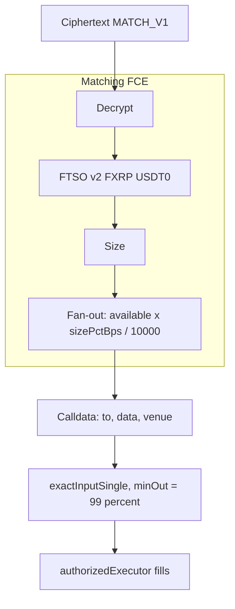

**Decrypt.** Ciphertext arrives as hex `originalMessage`. With `SIGN_PORT` set, tee-node decrypts inside the enclave. Plaintext fallback is an explicit env gate for local smoke and is **disabled** on the adversarial path. Failed decrypt with fallback off is a hard error, not a best-effort parse of ciphertext-as-JSON.

**Validate without logging secrets.** Asset must be `FXRP` or `USDT0`. Direction must be `BUY` or `SELL`. `sizePct` must be a positive finite number. The handler refuses to print decrypted fields. That is how you keep “the TEE has plaintext” from becoming “the operator's stdout has plaintext.”

**FTSO inside the TEE.** The extension reads `ContractRegistry` at `0xaD67FE66660Fb8dFE9d6b1b4240d8650e30F6019`, then FTSO v2 feeds. RPC defaults to public Coston2 if `FLARE_RPC_URL` is not in the enclave env. Prices used for sizing are the same family of feeds [`FtsoPriceReader`](contracts/src/FtsoPriceReader.sol) exposes on-chain, so a public observer can check that the *oracle* was live even though they cannot see the *size*.

**Fan-out.** The engine loads `getFollowers(lead)` from MirrorRegistry, then for each address reads `getBalance` and `getPendingLocked` from MirrorVault:

```text
available = max(balance - pendingLocked, 0)
amount    = available * sizePctBps / 10_000
```

Zero amounts are dropped. A follower mid-fill cannot be double-spent by the next signal. A follower who withdrew to pending is not silently copied at full notional.

**Venue calldata.** The FCE assembles `{ to, data, venue }`. It does **not** broadcast. `exactInputSingle` encodes token in/out, FTSO-expected amount, and `minOut = expected × 0.99`. Enosys/Firelight mock venues, when enabled, skip the swap path and return strategy calldata instead — same instruction shape, different destination.

Venues on Coston2: `mock-sparkdex` default, optional BlazeSwap V2, Enosys/Firelight if `MIRROR_MOCK_VENUES`. The matching engine's job is identical in all three: decrypt, size, encode, return. The venue is a destination, not a second matching brain.

### Fill and settlement

A TEE result is not a vault delta. Settlement is a second, public act with a proof.

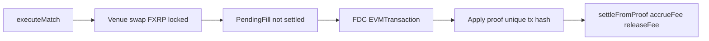

**executeMatch.** Only `authorizedExecutor` (or owner) on [`InstructionSender`](contracts/src/InstructionSender.sol). The function pulls locked FXRP, calls the wired router, records `amountIn` / `amountOut`, and emits `MatchExecuted`. Followers' *settled* balances are still unchanged. That is the point of `PendingFill`.

**PendingFill.** Exists, not settled. Token in, token out, amounts, profit, epoch, follower, lead. If the process died here, funds are locked, not silently credited. The UI can show “fill seen, proof pending.” It cannot show a fake PnL.

**FDC attest.** Relayer in [`scripts/relayer/`](scripts/relayer/) requests an `EVMTransaction` attestation for the swap. Round time on Coston2 is on the order of the FDC window, not a block. This is why demos sometimes skip slow FDC: the mechanism is real and slow on purpose.

**Apply proof.** `applyFdcSettlement` / `settleFromProof` checks verifier output, router, amounts, status `1`, and a **unique** transaction hash. Reused proofs revert. Wrong router reverts. Failed tx status reverts. After success: vault delta, `accrueFee`, `releaseFee` path.

**Fees.** Lead takes 0–20% of profit as configured on the registry. Protocol takes 10% of that cut (`PROTOCOL_FEE_BPS = 1000`). The protocol slice is computed; routing it into FIRE / FIP.16 is roadmap, not a hidden transfer. `claim()` always reverts. There is no “just send me my fees” function.

**Withdrawals.** Followers do not `transfer` FXRP out of a hot balance during a live copy. They `requestWithdrawal`. Funds return after unwind, not as an instant ERC20 escape hatch that races the next match. Proof-free `settleBatch` is off by default (`legacySettleBatchEnabled = false`). The owner can enable it only for controlled tests or emergency TEE-admin paths. Production speech uses `settleFromProof`.

### Follower on Flare

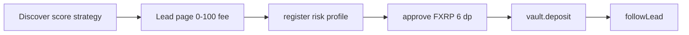

Discover ranks by attested score and strategy badge, not by who shouted. The lead page shows 0–100 and fee percent. Registration stores a risk profile: conservative, moderate, aggressive. That byte is on-chain because the scorer and the UI need a stable preference. It is not a decryption of the lead.

Approve and deposit use FXRP at 6 decimals. People who type `10` mean ten FXRP, not a dust fraction. `followLead` creates the `(follower, lead)` edge. Copying starts on the **next** encrypted signal. There is no extra “arm” click. If you are following and funded, you are in the fan-out.

Under the deposit:

```text
ONE SUB-ACCOUNT  ·  (follower, lead)
MirrorVault  ·  InstructionSender is the only mover
balance  ·  pendingLocked during fill  ·  never sees sizePct or direction
```

A follower can follow more than one lead; each pair is a separate sub-account. That prevents lead A from spending funds allocated to lead B. It also means “portfolio” is a list of edges, not a single blended wallet.

Risk stays on-chain. The matching engine does not currently refuse a signal because a conservative follower followed an aggressive lead — selection is a Discover/UI job plus drift alerts. The vault will still size from balance. Product-wise, that is “you chose this lead”; safety-wise, drift alerts exist so the choice can be revisited when the lead is no longer the lead.

### Follower from XRPL

The XRPL path exists because some might have never have touched an EVM wallet.

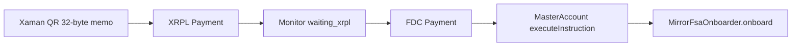

The follower pays from Xaman to operator `rEyj8nsHLdgt79KJWzXR5BgF7ZbaohbXwq` with a 32-byte memo that binds the intent (lead, risk, session). [`scripts/relayer/xrpl-monitor.ts`](scripts/relayer/xrpl-monitor.ts) watches for `waiting_xrpl`. That monitor is an indexer, not a proof. The proof is FDC Payment (`testXRP` on testnet, on the order of a 90s round).

Only after attestation does `MasterAccountController.executeInstruction` run. The Smart Account then calls [`MirrorFsaOnboarder.onboard`](contracts/src/MirrorFsaOnboarder.sol):

```text
registerFollowerAs  →  followLeadAs  →  vault.depositFor
```

`msg.sender` is the PersonalAccount. From here the follower is identical to the EVM path. No C2FLR required to *be* a follower. Combined Core Vault mint-and-onboard still needs mint liquidity on Coston2 — the canary proves FDC Payment plus the onboarder, and does not fake a mint that the testnet cannot support.

This is the onboarding story XRPFi actually needed. “Buy FLR, bridge, find a DEX, copy a wallet” is how you lose the forty million. “Pay XRP, get an FXRP vault on a scored lead” is how you don't.

### Scoring FCE

Leads get scored in a second enclave so popularity cannot be gamed by a matching-engine commit, and so private outcome history never becomes a public tape.

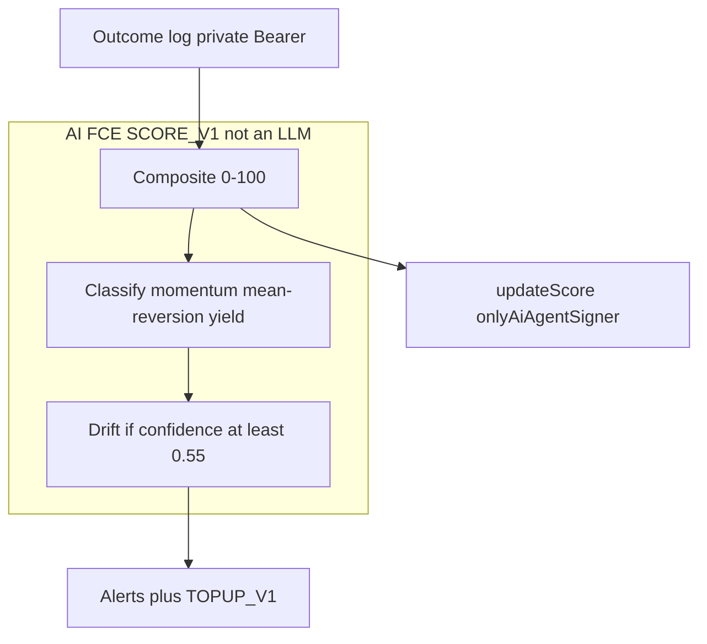

The agent is **not a language model**. [`fce-ai-agent/README.md`](fce-ai-agent/README.md) says it plainly. [`scoring.ts`](fce-ai-agent/typescript/src/app/scoring.ts) implements the formula.

Weights:

| Component | Weight | What it measures |
|---|---|---|
| Sharpe-equivalent | 40% | Mean return over volatility, annualized with √365 for daily-ish bars |
| Max drawdown | 25% | Peak-to-trough on compounded period returns; lower drawdown raises the score |
| Cadence / consistency | 20% | Regular spacing of outcomes; high coefficient of variation of gaps pushes toward 0 |
| Data completeness | 15% | More events in a 30-day window, targeting about one per day for full credit |

Sharpe maps to 0–1 by dividing by 2 and clamping — a Sharpe of 2 saturates that factor. Drawdown maps as `1 − mdd`. Completeness is `min(1, events_in_30d / 30)`. The integer score is the rounded 0–100 of the weighted sum.

Classification is rule-based over the private log: momentum, mean-reversion, yield. Drift fires when the live class disagrees with baseline at confidence ≥ `0.55` (configurable). That alert is how Mirror says “this is no longer the lead you followed” without publishing the new book.

`updateScore` on [`MirrorLeaderboard`](contracts/src/MirrorLeaderboard.sol) is `onlyAiAgentSigner`. Today that signer is a host key authorized to push attested scores, not the TEE wrapping the transaction itself. The computation is enclave-side; the on-chain ACL is still a signer. The roadmap's TEE-resident PMW work is the same class of tightening.

Web2Json (DeFiLlama / CoinGecko) is attested in canaries and stored as an attestation id. It is **not** mixed into the 0–100 weights. If it were, a website outage or a scraped TVL joke would move Discover. Mirror refuses that.

Outcome log access is private and Bearer-gated (`GET /internal/outcome-log`). The matching engine records fill PnL (FTSO quote versus `amountOut`, plus FXRP mark-to-market since the previous fill). Mock SparkDEX fills at mid, so execution PnL is near zero; Sharpe then moves from interval FTSO returns and needs at least two fills. That is an honest Coston2 quirk, not a scoring bug.

### After the fill

What followers see is deliberately less than what the TEE knows.

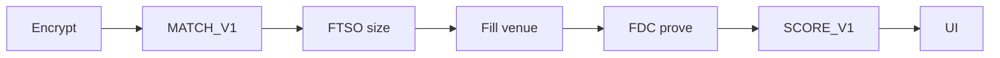

Four UI states after that loop:

**Healthy.** Balance, epoch P&L, classification only. “Mean-reversion lead — ahead on epoch P&L.” No tape.

**Drift detected.** Class ≠ baseline. Review allocation. This is the missing safety net every CEX copy product still lacks. A yield lead that wakes up as leveraged momentum is not a vibe shift. It is a different product.

**Liquidation risk.** Collateral ratio under `13000` bps (alert before a mock liquidate at `11000`). Optional `TOPUP_V1` if the follower pre-authorized a max top-up on [`MirrorHealthAuth`](contracts/src/MirrorHealthAuth.sol). The matching engine can then size a top-up without the follower being at the keyboard — still through the TEE, still not a random admin push.

**Withdraw.** `requestWithdrawal`, then funds after unwind. Copying and instant exits cannot share an unlocked balance without racing. Mirror picks the boring order: stop copying that notional, then return it.

The strategy itself is never shown. If a future UI “just shows the last five trades for engagement,” that UI has left the protocol. The contracts will not save a frontend that publishes the book.

### Operator surfaces

Some processes are allowed to be operators. They are not allowed to be oracles of truth.

**tee-proxy.** Public endpoint in front of the matching FCE. Forwards signed FCC instructions. Serves `/info` (encryption pubkey, code hash) and `/action/result/{id}`. If the proxy decrypted, it would be a third TEE with no hash. It must not.

**Fill-worker.** Polls TEE results, calls `executeMatch` as `authorizedExecutor`. The UI waits. This split keeps venue submission off the lead's laptop. Until PMW signing is complete, this worker is the honest centralized step, gated by the sender ACL and by FDC before vault movement.

**FDC relayer.** Builds `EVMTransaction` and Payment attestations, submits them, calls settlement. It cannot settle a swap that FDC will not attest. It cannot reuse a hash.

**XRPL monitor.** Detects payments early so the UX can say “we saw it.” Settlement still waits for FDC.

**Drift / health monitors.** Loops that read classification and collateral, write alerts, and optionally enqueue `TOPUP_V1`. They do not rewrite scores. They do not move funds without HealthAuth plus the matching FCE.

**What the operator cannot do.** They cannot read Stage B plaintext on the public surface (adversarial suite). They cannot `claim` fees. They cannot `settleBatch` in default config. They cannot `updateScore` without the AI signer. They cannot `depositFor` without being the FSA onboarder. They cannot unlock vault FXRP except as InstructionSender.

That is the operator model: logistics, not authority.

### The signal, hop by hop

It helps to walk one sealed intent as if you were sitting on the wire — without ever seeing the body.

**1. Lead encrypts.** Browser loads TEE pubkey from `/info`. `encrypt.ts` produces an ECIES blob. The JSON that went in (`asset`, `direction`, `sizePct`, `nonce`, `lead`) is gone from the process the moment the box is sealed. Refreshing the page does not put it on-chain. A malicious RPC can see a transaction to InstructionSender. It cannot see `SELL`.

**2. Instruction pays the TEE.** `sendInstructions` with `opType = MIRROR`, `opCommand = MATCH_V1`, fee `1e6` wei. TeeManager emits an instruction id. The UI stores that id and polls the proxy. Polling is not decrypting. The proxy returns status and, later, a result object that still must not contain plaintext fields on public surfaces.

**3. Enclave decrypts and sizes.** `handleMirrorMatchStageB` decrypts, validates, reads FTSO, reads followers, reads vaults, drops zeros, encodes `exactInputSingle`. Logs stay clean. If decrypt fails and fallback is off, the instruction dies in the enclave rather than “helpfully” treating ciphertext as JSON.

**4. Executor fills.** Worker calls `executeMatch`. Router transfers tokens at the mocked (or Blaze) venue. Vault locking has already isolated the notional. `PendingFill` is born. `MatchExecuted` fires. Portfolio may show “fill seen.” It must not show a settled delta yet.

**5. Relayer proves.** FDC round. Proof returns. `applyFdcSettlement` consumes the hash. Vault `settleFromProof`. Fee `accrueFee` / `releaseFee`. `FillSettled`. Now the public tape matches the private intent's *consequence*, still without revealing the intent.

**6. Scorer updates.** Outcome log receives PnL bps. `SCORE_V1` recomputes the composite. Leaderboard `updateScore`. Discover moves. Drift monitor compares class to baseline. Health monitor compares CR to `13000` bps. Alerts are English. The book stays inside.

If you skip hop 1, you are eToro-on-chain and farmed. If you skip hop 5, you are a trusted operator. If you skip hop 6, Discover becomes a popularity contest. The hops are not a pipeline diagram for a grant. They are the minimum set that keeps the product from collapsing into one of those two failures plus a vanity board.

### Sizing, in numbers rather than slogans

Suppose three followers of one lead, FXRP 6 decimals, `sizePct` such that `sizePctBps = 2500` (25% of available).

| Follower | balance | pendingLocked | available | copy amount |
|---|---|---|---|---|
| F1 | 1_000_000000 | 0 | 1_000_000000 | 250_000000 |
| F2 | 400_000000 | 100_000000 | 300_000000 | 75_000000 |
| F3 | 50_000000 | 50_000000 | 0 | dropped |

F3 is in-flight or fully locked. They are not “copied at dust.” They are omitted. F2 is not copied on the locked 100. The lead's `sizePct` is a fraction of **available**, not a promise of a fixed FXRP notional, and not a clone of the lead's personal wallet size.

Expected USDT0 out for a SELL is FTSO FXRP/USD over FTSO USDT0/USD, times amount, with `minOut` at 99%. If the venue cannot meet that, the swap fails and PendingFill never becomes a fake profit.

This is why Mirror can say “fair fill” without meaning “best fill in the universe.” Fair means: same oracle, same fraction, no mempool stampede, no follower accidentally oversized because a UI showed the lead's last ticket.

### Scoring, in numbers rather than slogans

Take a lead with a short, clean history: ten periods, each `+40` bps (`0.004`), almost no variance, regular daily timestamps, ten events inside thirty days.

Sharpe-equivalent explodes because variance is tiny — the code even special-cases `stdev == 0` with a cap-like `10` when mean is positive. `normalizeSharpe` clamps `sharpe / 2` to `[0, 1]`, so extra Sharpe above 2 does not print `150` on Discover. Drawdown on a monotone up series is `0`, so the drawdown factor is `1`. Cadence on regular gaps is near `1`. Completeness is `10/30 ≈ 0.33`.

Weighted:

```text
0.40 * 1.00  +  0.25 * 1.00  +  0.20 * 1.00  +  0.15 * 0.33
= 0.40 + 0.25 + 0.20 + 0.05
= 0.90  →  score 90
```

A second lead with the same average return but deep drawdowns and irregular cadence will lose the 25% and 20% buckets even if Twitter thinks they are a genius. That is the point of not ranking by raw PnL.

Completeness at 15% is a cold-start tax. New leads look unfinished because they are. The pitch's “scores stay 0 until real fills” is the same idea at genesis: do not paint 90 on a wallet that has not been copied yet.

Mock SparkDEX filling at mid means a single fill's execution PnL is ~0. Sharpe then needs **more than one** fill so interval mark-to-market returns exist. A canary that scores from a fixture is a canary. Live Discover on Coston2 should be read with that in mind: two fills of a mid-mock are an FTSO path, not a SparkDEX alpha path.

### What the frontend is allowed to say

[`/discover`](frontend/src/app/discover/page.tsx) — ranked leads, score, badge, fee. A catalog, not a blotter.

[`/lead/[address]`](frontend/src/app/lead/[address]/page.tsx) — the public identity of one edge of the graph. Enough to decide to follow. Not enough to reconstruct sizePct.

[`/lead/onboard`](frontend/src/app/lead/onboard/page.tsx) — commit fee, strategy, tee hash. The lead's last plaintext moment is this form, and it is metadata, not a trade.

[`/signal`](frontend/src/app/signal/page.tsx) — the encryption booth. After submit, wait on `MatchExecuted`. Do not execute.

[`/follower/onboard`](frontend/src/app/follower/onboard/page.tsx) — risk, approve, deposit, follow.

[`/follower/xrpl`](frontend/src/app/follower/xrpl/page.tsx) — Xaman, memo, wait on FDC, then the same vault graph.

[`/portfolio`](frontend/src/app/portfolio/page.tsx) — classification-level English, balances, alerts.

[`/withdraw`](frontend/src/app/withdraw/page.tsx) — `requestWithdrawal`, not a DEX exit.

API routes under [`frontend/src/app/api/`](frontend/src/app/api/) are plumbing: leads list, tee-info, execute-match for the worker, outcomes, alerts, refresh-score. They are not a plaintext sidecar. If an API returns decrypted signals, it has left the architecture even if the contracts remain perfect.

---

## Contracts

Contracts are the public half of the privacy boundary. They never see the signal body. They are aggressive about who may move FXRP.

### The call graph

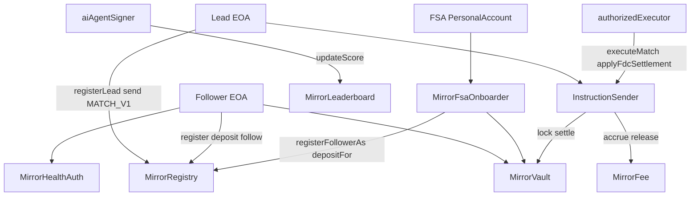

Read this as a permissions picture, not a sequence. If an arrow is missing, the call should revert.

### MirrorRegistry

Source: [`contracts/src/MirrorRegistry.sol`](contracts/src/MirrorRegistry.sol).

Registry is identity and graph, not custody. Leads register a strategy type, a fee rate in bps, a minimum allocation, and a TEE public-key hash. Followers register a risk profile. `followAllocations` records the active edge.

Invariants worth keeping in your head:

- A wallet cannot register twice as the same role without going through the designed path.
- Fee rate is capped at 20% (`2000` bps). A lead cannot set “50% because I am famous.”
- Followers cannot follow below `minAllocation`.
- FSA onboarding uses `registerFollowerAs` / `followLeadAs`, gated by `onlyFsaOnboarder`. A random contract cannot invent followers.

```solidity
struct LeadTrader {
    address wallet;
    uint8 strategyType;
    uint16 feeRateBps;
    uint256 minAllocation;
    bytes32 teePublicKeyHash;
    bool verified;
}
```

`strategyType` is the public badge (momentum, mean-reversion, yield, …). It is not the private book. `verified` is an owner/attestation flag for GTM, not a substitute for score. `teePublicKeyHash` is how the UI and a reviewer check that encryption targets the enclave the lead committed to.

The registry is allowed to be public. Copy trading needs a discoverable graph. What it must not become is a tape of sizes. It doesn't store them.

### MirrorVault

Source: [`contracts/src/MirrorVault.sol`](contracts/src/MirrorVault.sol).

The vault is a single-asset FXRP custodian keyed by `(follower, lead)`.

```solidity
struct SubAccount {
    uint256 balance;
    uint256 pendingWithdrawal;
    uint256 pendingLocked;
}
```

**Only InstructionSender** may lock, settle, or otherwise move execution balances. **Only the FSA onboarder** may `depositFor`. Followers deposit their own funds with `deposit`. They request withdrawals; they do not yank locked notional during a fill.

`pendingLocked` is the in-flight fill. Matching uses `balance − pendingLocked` as available. That is how two signals cannot spend the same FXRP.

`legacySettleBatchEnabled` defaults to **false**. `settleBatch` without a proof reverts with `ProofRequiredUseSettleFromProof`. The function exists because early phases needed a TEE-admin path. Default-off is the product.

Events (`Deposited`, `LockedForExecution`, `SettledFromProof`, `WithdrawalRequested`) are the public tape followers *are* allowed to see: money moved, not why.

Nonce uniqueness on settlements stops replay of a delta. A proof that credited +X cannot be replayed to credit +X again through the vault's own nonce map, in addition to the sender's proof-hash map.

### MirrorFee

Source: [`contracts/src/MirrorFee.sol`](contracts/src/MirrorFee.sol).

Fees are a delayed, proven split of **profit**, not of notional.

- `MAX_LEAD_FEE_BPS = 2000` (20%)
- `PROTOCOL_FEE_BPS = 1000` (10% of the lead's gross fee)
- `BPS_DENOMINATOR = 10000`

`quoteNetFee` is the view. `accrueFee` is `onlyInstructionSender` and requires profit > 0 and a registered lead. Gross fee is `profit * feeRateBps / MAX_LEAD_FEE_BPS` — note the denominator is the max lead fee, so a lead at 2000 bps takes 100% of the configured slice of profit, then protocol skims 10% of that gross.

`claim(address)` is `pure` and **always reverts** `ProofRequired`. That is the most readable invariant in the repo. If you find a way to withdraw fees without `releaseFee`, you have broken the product.

`releaseFee` verifies FDC, demands status `1`, burns the tx hash in `usedProofs`, pays the **lead**, never `msg.sender`. Relayers cannot redirect payouts.

The protocol's 10% is accounted. It is not yet the FIRE buyback engine. The roadmap says when that happens. Until then, do not describe Mirror as already burning FLR.

### MirrorLeaderboard

Source: [`contracts/src/MirrorLeaderboard.sol`](contracts/src/MirrorLeaderboard.sol).

A tiny contract with a large job: publish a number that is allowed to be public.

```solidity
struct ScoreRecord {
    uint8 score;
    bytes32 attestationId;
    uint256 updatedAt;
}
```

`updateScore` is `onlyAiAgentSigner`. Score cannot exceed 100. `attestationId` is the hook for Web2Json / FDC context — a bytes32 reference, not a blob of CoinGecko JSON on-chain.

Discover reads this. Followers should treat a missing score as “not enough data,” which the completeness weight already encodes as a low composite. Seeding fake 90s for launch would be a different product. The pitch is explicit: scores stay 0 until real fills.

The signer ACL is the remaining trust assumption on this contract. The formula is open. The push is keyed. Tightening the push into the scoring FCE's PMW is the honest next step, not a claim we will make early.

### InstructionSender

Source: [`contracts/src/InstructionSender.sol`](contracts/src/InstructionSender.sol).

This is the spine.

It is the FCC instruction sender for matching (`OP_TYPE_MIRROR`, `OP_COMMAND_MATCH_V1`, `OP_COMMAND_TOPUP_V1`). It is the only authorized forwarder for vault settlements and fee accrual. It enforces nonce ordering. It holds `PendingFill` until FDC.

```solidity
bytes32 public constant OP_COMMAND_MATCH_V1 = bytes32("MATCH_V1");
bytes32 public constant OP_COMMAND_TOPUP_V1 = bytes32("TOPUP_V1");
```

`sendMirrorMatchStageB` (and the greeting canary `SAY_HELLO`) pay into TeeExtensionRegistry with the latched `_extensionId`. Extension id is found once via `setExtensionId` by scanning `getTeeExtensionInstructionsSender`. That latch is how the contract refuses to send into a random extension after deploy.

`executeMatch` is `onlyAuthorizedExecutor`. It talks to `ISwapRouter.exactInputSingle`. It emits `MatchExecuted` with fill id, follower, lead, amounts.

Settlement checks `usedProofTxHashes`. A unique Flare-attested hash is a one-time ticket. `FillSettled` is the public “you may now believe the vault delta” event.

Tee registries are optional at constructor time so older deploys could be wired later. On the Coston2 set in `config/coston2.json`, they are wired. An InstructionSender with no extension id cannot be the FCC path.

### AiAgentSender

Source: [`contracts/src/AiAgentSender.sol`](contracts/src/AiAgentSender.sol).

A second sender on purpose.

Constructor, `setExtensionId`, and `_getExtensionId` follow the FCC scaffold and are not to be casually rewritten. `OP_COMMAND_SCORE_V1` is the matching engine's sibling, not a function on InstructionSender. Mixing them would let scoring instructions look like match instructions at the registry.

`sendScoreV1` pays `sendInstructions` against the **AI** extension id. Greeting `SAY_HELLO` exists as a bring-up canary so operators can prove the extension is alive before scoring real leads.

If matching and AI senders were the same contract, a confused relayer could submit a score payload to the matching FCE or a match payload to the scorer. Two senders make that a type error at the routing layer.

### FtsoPriceReader and AnchorDivergenceGuard

Sources: [`contracts/src/FtsoPriceReader.sol`](contracts/src/FtsoPriceReader.sol), [`contracts/src/AnchorDivergenceGuard.sol`](contracts/src/AnchorDivergenceGuard.sol).

`FtsoPriceReader` is a thin wrapper around `TestFtsoV2Interface` via `ContractRegistry.getTestFtsoV2()`. It exposes `getFxrpUsdInWei` and `getUsdt0UsdInWei`. Feed ids are the official bytes21 values for `XRP/USD` and `USDT/USD`. Using TestFtsoV2 on Coston2 is the supported view path, not a mock oracle.

`AnchorDivergenceGuard` is a helper, not a token. Constructor fixes `notionalThresholdWei` and `maxDivergenceBps`. `checkDivergence` no-ops under the threshold, reverts on zero anchor, and otherwise computes `(diff * 10_000) / anchorPriceWei`. Above tolerance: `DivergenceExceeded`.

Together they answer two searcher-shaped questions: “can I move the size by poking a pool?” (no, FTSO) and “can I ride a one-block oracle blip into a copy wave?” (not above the notional threshold).

### MirrorFsaOnboarder and MirrorHealthAuth

Sources: [`contracts/src/MirrorFsaOnboarder.sol`](contracts/src/MirrorFsaOnboarder.sol), [`contracts/src/MirrorHealthAuth.sol`](contracts/src/MirrorHealthAuth.sol).

**Onboarder.** Single call: validate lead, enforce `minAllocation`, `registerFollowerAs` if needed, `followLeadAs` if needed, pull FXRP, `depositFor`. `msg.sender` is the PersonalAccount. Event `FsaOnboarded` is the public breadcrumb for the XRPL path without exposing the XRPL payment memo's private intent beyond what FDC already attests.

The onboarder must be set on both Registry and Vault. If it is unset, FSA users cannot enter. If it is set to a hostile address, that address can register followers and deposit **their** approved FXRP — it still cannot drain other sub-accounts, because it is not InstructionSender. Privilege is onboarding, not custody.

**HealthAuth.** Followers opt in to autonomous top-ups per lead with a `maxTopUp` cap. `isAuthorized` is the boolean the matching path should respect before `TOPUP_V1` spends. The health monitor address is recorded for operators; the authorization is the follower's.

Default is off. Mirror will not “helpfully” top up a CDP because a bot is nervous. Pre-authorization is the consent boundary.

### Venue stand-ins

Sources under [`contracts/src/mocks/`](contracts/src/mocks/).

| Stand-in | Role on Coston2 |
|---|---|
| MockSparkDexRouter | SparkDEX V3 `exactInputSingle` ABI, real ERC20 transfers, FTSO prices |
| BlazeSwap pair (not a mock contract — a seeded pool) | One real V2 swap path with deployer-as-LP |
| MockKineticPool | Lending-strategy interface until Kinetic Coston2 is verified |
| MockEnosysCDP | CDP interface; Enosys testnet is not Coston2 |
| MockFirelightStrategy | Passive-staking router; real vault address reserved |

These are ABI stand-ins, not “fake DeFi” for screenshots. `MockSparkDexRouter` moves real testnet FXRP and USDT0. Fill PnL at mid is near zero, which is why scoring leans on mark-to-market across fills. That is an economic consequence of an honest mock, and it is documented here so nobody “fixes” Sharpe by inventing execution edge that the mock cannot have.

Mainnet SparkDEX `SwapRouter` `0x8a1E35F5c98C4E85B36B7B253222eE17773b2781` is recorded as a **reference only**. Pointing Coston2 configs at it is how you send calldata into an empty account.

### InstructionSender, more slowly

It is worth sitting with this contract because almost every other file in the repo is either a client of it or a reason it exists.

**Construction.** Vault, fee, registry, authorized executor, owner. The FCC registries are *not* in the constructor. They are `set` once, later, so a Phase-1 deploy could become a Phase-3 deploy without a new vault. `TEERegistryAlreadySet` makes that a one-shot. You do not get to hot-swap TeeExtensionRegistry if you regret the address. That is inconvenient for operators and correct for users.

**Extension id latch.** `setExtensionId` walks public extension ids from `0x10000` until it finds `getTeeExtensionInstructionsSender(i) == address(this)`. After that, matching instructions cannot silently retarget a different FCE without a new sender contract. The code hash of the *image* can still change if FCC allows a new version — that is why published hashes and `fce:compare-hashes` exist as an off-chain complement to this on-chain latch.

**Stage B versus greeting.** `SAY_HELLO` is how you prove the pipe is alive. `MATCH_V1` is how you copy. `TOPUP_V1` is how health consent becomes a match-shaped instruction instead of a backdoor `executeMatch` with a made-up swap. Keeping top-up on the same sender as matching means the same executor ACL and the same enclave family handle “copy this” and “add collateral,” which is what the PRD asked for: the AI agent does not submit transactions directly.

**PendingFill fields.** Follower, lead, tokenIn, tokenOut, amountIn, amountOut, profit, epochId, exists, settled. Profit is computed from the fill, not from a lead-supplied number. Epoch is how fees group. `exists` versus `settled` is the two-phase commit: you may not settle a ghost, and you may not settle twice.

**Router wiring.** `swapRouter` is settable by owner. On Coston2 it points at MockSparkDexRouter. On mainnet it should point at SparkDEX V3. The ABI is `ISwapRouter`. If someone sets it to an EOA, `executeMatch` fails closed rather than sending FXRP into the void — but owner power here is real, which is why audit is roadmap row one.

**Fdc verifier wiring.** Same story. Unset verifier: settlement reverts `FdcVerifierNotSet`. That is better than a default mock verifier left in production.

**Executor versus owner.** `onlyAuthorizedExecutor` allows executor *or* owner. Owner is a recovery hatch. In a mature deploy, owner should be a timelock, and executor should be the PMW. Today, say the hatch exists.

### MirrorVault, more slowly

Deposits increase `balance` for `(msg.sender, lead)` or, for `depositFor`, `(follower, lead)` with onboarder as caller. The token is always the immutable `fxrpToken`. You cannot accidentally deposit USDT0 into the vault accounting. USDT0 exists on the other side of a swap, not as a second sub-account currency.

`requestWithdrawal` moves value into `pendingWithdrawal` rather than pushing ERC20 in the same breath as a live `pendingLocked`. The unwind path is how copy and exit fail to deadlock: you cannot copy locked funds, and you cannot withdraw them as if they were free.

`LockedForExecution` is the matching engine's on-chain shadow. The TEE read `getPendingLocked` in the same breath as `getBalance`. If those views lied, fan-out would double-spend. They must not lie. There is no “operator lock” function exposed to a random relayer.

`SettledFromProof` carries `int256 balanceDelta`. Losses are first-class. A copy product that can only increase balances is a casino that deletes losing tickets. Mirror's vault is allowed to go down because trades are allowed to be wrong. Fees accrue on profit, not on volume, which is the other half of that honesty.

Duplicate nonce: revert. A settlement is a signed (by the sender contract) delta with a unique nonce per follower stream. Replay is not a rounding error.

### MirrorRegistry, more slowly

`getFollowers(lead)` is the fan-out list the TEE trusts more than a client-supplied `followers[]` array. The handler may accept a payload list for tests; production fan-out should follow the registry. If a lead could omit a follower in ciphertext, they could run a private club inside a public vault graph. The registry list is the club.

`getLead` returning a zero wallet is the “this address is not a lead” signal used by the onboarder and the fee contract. Fees cannot accrue to a meme address. Onboarding cannot target a void.

`verified` is not the score. It is a GTM bit for “we checked this human exists.” Mixing verified and score would recreate influencer boards. Keep them separate: verified is a badge, score is math.

Unfollow exists. Copying is not a soulbind. Unfollow plus withdrawal is how a drift alert becomes an action rather than a notification the user cannot honor.

### MirrorFee, more slowly

Work a fee example, because the denominator surprises people.

Lead fee rate `1000` bps (10% of the 20% max, i.e. half of the allowed lead cut). Profit on a fill `1_000_000` (1 FXRP at 6 decimals).

```text
grossFee    = 1_000_000 * 1000 / 2000  = 500_000
protocolFee = 500_000 * 1000 / 10000   = 50_000
netFee      = 450_000
```

The lead eventually receives `0.45` FXRP from that 1 FXRP profit, after FDC. Protocol accounts `0.05`. The follower's vault delta must already reflect the trade; fee is not an extra hidden withdrawal from the follower beyond the profit split the lead advertised.

If `feeRateBps` is `0`, gross is `0`, accrue returns `0`, nobody plays a fee game on a free lead. If profit is `0` (mid-mock fill), there is nothing to split. That is why Coston2 demos can look “feeless” even with a 10% lead: there was no profit. Mainnet SparkDEX with real slippage and real direction will not look like that.

`releaseFee` pays `lead`, not `msg.sender`. A relayer who proves the swap cannot assign the payout to themselves. Amount must be `<= accruedFees[lead]`. Partial release is possible; over-release is not.

### Leaderboard and AiAgentSender, together

The leaderboard is a sink. AiAgentSender is a faucet of instructions into the scoring FCE. The host signer that calls `updateScore` is the awkward middle until PMW lands.

Why not let InstructionSender push scores? Because then the matching executor could paint Discover. Why not let anyone submit Web2Json ids? Because then a lead would attest their own blog. The signer is a choke point. Choke points should be embarrassing enough to replace. This one is named in the pitch diagram: “onlyAiAgentSigner · host, not TEE.”

`SCORE_V1` payload never needs to be on the leaderboard. Only `uint8 score` and `bytes32 attestationId`. That is the same privacy pattern as the vault: publish the consequence, not the series.

### FSA onboarder, the three calls

People ask why onboard is not just `deposit`. Because XRPL users have no registry row, no follow edge, and no approval history on Flare.

1. `registerFollowerAs(follower, riskProfile)` — follower is `msg.sender` (PersonalAccount). Risk is chosen in the Xaman memo flow, not defaulted to aggressive.
2. `followLeadAs(follower, lead, amount)` — amount must meet `minAllocation`. The edge is created so the next `MATCH_V1` includes them.
3. `depositFor(follower, lead, amount)` — FXRP that the Smart Account holds (after mint/credit) moves into the vault pair.

If step 2 happened without step 3, they would be in the fan-out at zero size (dropped). If step 3 happened without step 2, they would have a balance the matcher might not see as a follower depending on registry reads. Atomic onboard is not convenience. It is consistency.

### HealthAuth, the consent object

```solidity
struct Auth {
    uint256 maxTopUp;
    bool enabled;
}
```

`preAuthorizeTopUp` is `msg.sender` scoped. You cannot enable top-ups for someone else. `isAuthorized(follower, lead, amount)` checks enabled, amount > 0, amount <= maxTopUp. The matching FCE should treat a failed check as “alert only.” A monitor that ignores this is an operator bug, not a user preference.

`healthMonitor` is an owner-set address for who the UI treats as the bot. It does not bypass Auth. If it ever does, that is a regression.

### Why mocks keep the real function names

`exactInputSingle` instead of `swapForMirror`. Blaze `addLiquidity` with extra `feeBipsA/feeBipsB` instead of a fake Uniswap. CDP functions named like Enosys rather than `mockOpenPosition`.

Rename-to-fit would make mainnet a rewrite. The Coston2 constraint — SparkDEX bytecode missing, Enosys on a different testnet, Kinetic unverified — is temporary. The ABI is the product's bet that Flare DeFi will be there when the executor key is gone and the audit is done.

A mock that fills at FTSO mid is economically dull and architecturally loud: it proves the pipe, it does not prove alpha. This README will not dress it as alpha.

---

## Roadmap

Harden the enclave path. Then take the same contracts to mainnet.

Production-ready first. Business second.

```mermaid
flowchart LR
  subgraph prod [Make it production-ready]
    audit[Audit]
    pmw[TEE-resident PMW]
    sizes[TEE-sized fills]
    fire[FIRE FIP.16]
    live[Live venues]
    mint[One-shot FSA mint]
    mon[Always-on monitors]
  end

  subgraph biz [Then the business side]
    mainnet[Flare mainnet]
    leads[Verified leads]
    gtm[Xaman GTM]
    liq[Liquidity partners]
    fees[Performance fees]
    tiers[stXRP then Kinetic Enosys]
    later[FBTC Songbird mobile]
  end

  prod --> biz
```

| Make it production-ready | Then the business side |
|---|---|
| Audit Registry, Vault, Fee, Sender, FSA onboarder, and both FCE code hashes | Deploy to Flare mainnet (chain 14) with the live SparkDEX V3 router |
| Finish TEE-resident PMW signing so the executor key is not a human EOA which was done for demo | Seed a small set of verified leads — scores stay 0 until real fills |
| Fill-worker uses TEE-sized amounts instead of re-deriving size | GTM through Xaman / XRPL: follow from XRP, never buy FLR first |
| Route the 10% protocol cut into FIRE / FIP.16 | Liquidity partnerships so FXRP/USDT0 can absorb copy waves |
| Swap mock SparkDEX / Kinetic / Enosys for live venue addresses | Lead acquisition via performance fees, not token incentives |
| One-shot FSA mint so XRPL → vault credit does not need an EOA top-up | Optional Firelight stXRP tier, then Kinetic / Enosys strategy leads |
| Always-on drift and health monitors, plus multi-operator FCC as the network matures | Only after fills are boring: FBTC markets, Songbird canary, and a mobile shell |

---

## Conclusion

Copy trading is a solved product everywhere except on a public mempool.

Mirror exists because Flare can keep an intent sealed until execution and still prove the fill afterward. FCC holds the plaintext. FTSO sizes the copy. FDC releases the vault and the fee. FXRP is the unit. Smart Accounts are the door for XRP holders who will never buy FLR first. Two FCEs keep matching and scoring from becoming one opaque binary. The contracts refuse to move money on an operator's word.

What stays private: the decrypted trade, who was sized and by how much, the matching math, the outcome log that feeds Sharpe and drift.

What stays public: ciphertext, the swap, the proof, the vault delta, a score from a published formula, a strategy badge that is not a tape.

If you take one idea from this README, take the exposure loop. A popular lead wallet on a transparent chain is not a product. It is an invitation. Mirror is the version where popularity is allowed — because the strategy never entered the mempool, and the fill is still something anyone can check.

Copy trading that launches loud and leaks on day one is not copy trading. It is a watched wallet with extra steps.

Mirror is the other thing: a sealed signal, a sized wave, a proven fill.

Thank you.
